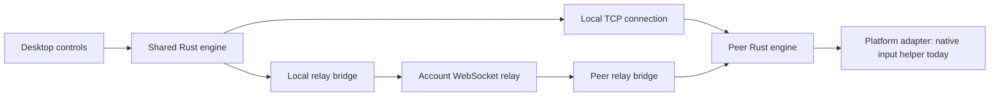

# System overview

[← Index](README.md) · [Code map →](architecture/code-map.md)

extend.computer connects devices to share input and displays across platforms. Devices can send and receive input, share their displays, and present displays from other devices.

- **Apps** manage device setup and connections.
- **Shared engine** manages identity, trust, authorization, and connections.
- **Platform adapters** provide each operating system's input and display capabilities.
- **Account service**, hosted or self-hosted, manages sign-in, device membership, presence, and encrypted relay transport.

## Sharing modes

| Mode | Purpose | Implementation status |
| --- | --- | --- |
| Share input | Use one device's keyboard and mouse to control another | macOS |
| Extend display | Use another device as an additional display | Not supported yet |
| Mirror screen | Present a copy of a device's screen on another | Not supported yet |
| Remote desktop | View and control another device through a remote connection | Not supported yet |

## Components

### Shared engine and clients

| Component | Responsibility | Source |
| --- | --- | --- |
| Desktop UI | Devices, permissions, account sign-in, connection controls, and updates | [`desktop/src/`](../desktop/src/) |
| Desktop runtime | Incoming/outgoing jobs, approvals, presence, and connection lifecycle | [`desktop/src-tauri/src/runtime.rs`](../desktop/src-tauri/src/runtime.rs) |
| Shared engine | Identity, trust, encrypted sessions, input ordering, and reconnect | [`engine/src/lib.rs`](../engine/src/lib.rs) |
| CLI | Terminal commands using the shared engine | [`engine/src/main.rs`](../engine/src/main.rs) |
| Account services | Sign-in, verified device membership, presence, and encrypted relay transport | [`web/`](../web/) and [`server/`](../server/) |

### macOS adapter

| Component | Responsibility | Source |
| --- | --- | --- |
| Native input helper | Screen-edge handoff, input capture, event injection, and emergency stop | [`native/macos/`](../native/macos/) |
| Permission bridge | Permission guidance and background-service setup | [`native/macos/Permissions/`](../native/macos/Permissions/) |
| Wi-Fi broker | Session-scoped AWDL optimization and restoration | [`native/macos/LowJitter/`](../native/macos/LowJitter/) |
| Updater | Sparkle integration and signed release feeds | [`native/macos/Updater/`](../native/macos/Updater/) |

## Connection lifecycle

Connecting to another device follows the same sequence across modes: identify the devices, authorize access, establish the connection, exchange data, and release resources when it ends.

1. Each app loads its device identity and saved trust. Private keys use the platform's secure storage, such as an OS credential store.
2. The devices establish trust through local pairing or verified membership in the same account. Discovery names and addresses are routing hints, not proof of identity.
3. The receiving device enables incoming connections. A mode can start only when its capabilities, user consent, and platform permissions are available.
4. The sender tries the saved local endpoint. Account-connected devices can fall back to an authenticated internet relay when the local connection fails.
5. The Rust engine establishes a Noise-encrypted session and pins the peer identity. Relay servers carry encrypted bytes; they do not replace peer authentication.
6. Platform adapters prepare the resources needed for the selected mode after authorization and readiness checks.
7. The devices exchange the selected mode's data. For example, input sharing forwards ordered events while preserving key and button transitions.
8. Heartbeats check responsiveness. Disconnect, emergency stop, loss of permission, or an unrecovered failure ends the connection and releases input and optimization resources.

## Connection paths

The same pinned encrypted protocol crosses either route. A loopback relay bridge is an implementation detail; it does not make the connection a local-network connection. Account presence can also use relay, so an online device is not proof that direct LAN access works.

## State and boundaries

- Device metadata stores names, addresses, and screen edges. It does not grant trust.
- Manual pairing persists verified identities independently of accounts.
- Account membership is refreshed and expires; its control consent is scoped to that membership.
- Platform capabilities and effective OS permissions gate each operation, independently of trust or a saved setup-complete flag.
- Platform-specific optimizations belong in adapters. The macOS implementation uses a privileged Wi-Fi broker with a narrow authenticated API, and native user-session helpers for input capture and injection.
- The desktop runtime permits one active connection job at a time. The CLI uses the same engine with its own operation and consent flow.

---

[← Index](README.md) · [Code map →](architecture/code-map.md)
