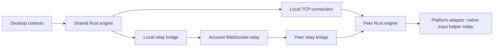

# System overview

[← Index](README.md) · [Code map →](architecture/code-map.md)

extend.computer connects devices to share input and displays across platforms. Devices can send and receive input, share their displays, and present displays from other devices.

- **Apps** manage device setup and connections.
- **Shared engine** manages identity, trust, authorization, and connections.
- **Platform adapters** provide each operating system's input and display capabilities.
- **Account service**, hosted or self-hosted, manages sign-in, device membership, presence, and encrypted relay transport.

## Sharing modes

| Mode | Purpose | Implementation status |
| --- | --- | --- |
| Share input | Use one device's keyboard and mouse to control another | macOS |
| Extend display | Use another device as an additional display | Not supported yet |
| Mirror screen | Present a copy of a device's screen on another | Not supported yet |
| Remote desktop | View and control another device through a remote connection | Not supported yet |

## Components

### Shared engine and clients

| Component | Responsibility | Source |
| --- | --- | --- |
| Desktop UI | Devices, permissions, account sign-in, connection controls, and updates | [`desktop/src/`](../desktop/src/) |
| Desktop runtime | Incoming/outgoing jobs, pairing verification, presence, and connection lifecycle | [`desktop/src-tauri/src/runtime.rs`](../desktop/src-tauri/src/runtime.rs) |
| Shared engine | Identity, trust, encrypted sessions, input ordering, and reconnect | [`engine/src/lib.rs`](../engine/src/lib.rs) |
| CLI | Terminal commands using the shared engine | [`engine/src/main.rs`](../engine/src/main.rs) |
| Account services | Sign-in, device membership, presence, and encrypted relay transport | [`web/`](../web/) and [`server/`](../server/) |

### macOS adapter

| Component | Responsibility | Source |
| --- | --- | --- |
| Native input helper | Screen-edge handoff, input capture, event injection, and emergency stop | [`native/macos/`](../native/macos/) |
| Permission bridge | Permission guidance and background-service setup | [`native/macos/Permissions/`](../native/macos/Permissions/) |
| Wi-Fi broker | Session-scoped AWDL optimization and restoration | [`native/macos/LowJitter/`](../native/macos/LowJitter/) |
| Updater | Sparkle integration and signed release feeds | [`native/macos/Updater/`](../native/macos/Updater/) |

## Device identity

Each device has a cryptographic key pair. Its public key identifies it to other devices; its private key stays on the device, protected by the platform's secure storage.

## Pairing and accounts

### Pairing

Users can select a device from nearby discovery and compare symbols, or pair manually by entering its address and pairing code.

During pairing, an encrypted handshake exchanges the devices' public keys. Comparing symbols verifies both keys belong to the intended devices. With manual pairing, both devices prove they know the same code, which verifies the key exchange in both directions. Each device saves a fingerprint of the other's public key to recognize it on later connections. Pairing remains until removed, independently of accounts.

### Account membership

Signing in registers the device's public key with the account service. The service verifies that the device holds the matching private key through a cryptographic challenge, then supplies other devices in the same account with its public-key fingerprint. Devices in the same account appear automatically, without exchanging pairing codes or comparing symbols.

On every new connection, including reconnects, the devices perform an encrypted handshake. The account service has already established which public keys belong to the account; the handshake proves that the device at the other end of this connection holds the matching private key and creates fresh encryption keys for the connection. Each device checks the other's public key against the fingerprint supplied by the account service. Access lasts while membership remains valid; signing out or removing a device ends account access.

Both pairing and account membership authorize connections. The receiving device needs **Allow connections** enabled and the OS permissions required by the selected mode. No additional connection approval is needed.

## Connection lifecycle

With pairing or account membership established, each connection to another device follows these steps:

1. The initiating device tries the latest saved local address. Background discovery can find a paired device or a device in the same account at a new address and update its record after verifying its public key. If the local connection fails, the app retries while discovery checks for a newer address. Relay fallback is currently disabled by the account server.
2. The engine performs a Noise handshake, checks the other device's identity against its pairing or account record, and establishes encryption. Relay servers forward encrypted data without decrypting it.
3. The receiving device checks the selected mode's capabilities and OS permissions before allowing it to start.
4. Platform adapters prepare the resources needed for the selected mode.
5. The devices exchange the mode's data. For example, input sharing forwards ordered events while preserving key and button transitions.
6. Heartbeats check responsiveness. Disconnect, emergency stop, loss of permission, or an unrecovered failure ends the connection and releases its resources.

## Connection paths

The local route connects devices directly over TCP. Background discovery checks nearby addresses for both paired devices and devices in the same account, trying local addresses before checking presence through the relay. Connection attempts use the latest saved address rather than starting a new discovery scan. If discovery has not found a local address yet, the app waits and retries.

The internet route is retained for future use and currently disabled. When enabled, it carries traffic through the hosted or self-hosted account server over WebSockets. This is a relay for the connection's encrypted data, not just a signaling server that helps devices connect directly. Both devices authenticate each other and encrypt their data end to end; the relay cannot decrypt it. Direct internet connections through NAT traversal are not implemented yet.

The server advertises relay availability when an account connection starts. Disabled relay attempts are handled quietly; temporary network interruptions leave the app reconnecting rather than ending the connection.

## Runtime constraints

- Platform-specific optimizations belong in adapters. The macOS implementation uses a privileged Wi-Fi broker with a narrow authenticated API, and native user-session helpers for input capture and injection.
- The desktop runtime permits one active connection job at a time. The CLI uses the same engine through terminal commands.

---

[← Index](README.md) · [Code map →](architecture/code-map.md)
