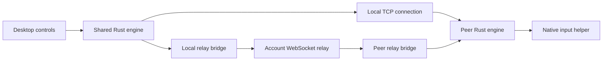

# System overview

[← Documentation](README.md) · [Contents](README.md) · [Code map →](architecture/code-map.md)

extend.computer shares keyboard and mouse input between two Macs. The desktop app supplies setup and session controls; the shared Rust engine authenticates devices and carries input; native macOS helpers capture and inject events.

## Components

| Component | Responsibility | Source |
| --- | --- | --- |
| Desktop UI | Devices, permissions, account sign-in, connection controls, and updates | [`desktop/src/`](../desktop/src/) |
| Desktop runtime | Incoming/outgoing jobs, approvals, presence, and connection lifecycle | [`desktop/src-tauri/src/runtime.rs`](../desktop/src-tauri/src/runtime.rs) |
| Shared engine and CLI | Identity, trust, encrypted sessions, input ordering, and reconnect | [`src/`](../src/) |
| Native input helper | Screen-edge handoff, input capture, event injection, and emergency stop | [`native/macos/`](../native/macos/) |
| Permission bridge | macOS permission guidance and background-service setup | [`native/macos/Permissions/`](../native/macos/Permissions/) |
| Wi-Fi broker | Session-scoped AWDL optimization and restoration | [`native/macos/LowJitter/`](../native/macos/LowJitter/) |
| Account services | Sign-in, verified device membership, presence, and encrypted relay transport | [`web/`](../web/) and [`server/`](../server/) |
| Updater | Sparkle integration and signed release feeds | [`native/macos/Updater/`](../native/macos/Updater/) |

## From setup to input

1. Each app loads its device identity and trust state. Production identities use macOS Keychain. Development uses a separate explicitly selected profile.
2. The devices establish trust through local pairing or verified membership in the same account. Discovery names and addresses are routing hints, not proof of identity.
3. The receiver enables incoming connections. Native permission checks and control consent gate input access.
4. The sender tries the saved local endpoint. Account-connected devices can fall back to an authenticated internet relay when the local connection fails.
5. The Rust engine establishes a Noise-encrypted session and pins the peer identity. Relay servers carry encrypted bytes; they do not replace peer authentication.
6. Eligible Wi-Fi sessions acquire optimization leases. Native helpers start after authorization and readiness checks.
7. Crossing an exposed configured screen edge transfers input to the receiver. Ordered event forwarding preserves key and button transitions while coalescing adjacent movement.
8. Heartbeats check responsiveness. Disconnect, emergency stop, loss of permission, or an unrecovered failure ends the session and releases input and optimization resources.

## Connection paths

The same pinned encrypted protocol crosses either route. A loopback relay bridge is an implementation detail; it does not make the connection a local-network session. Account presence can also use relay, so an online device is not proof that direct LAN access works.

## State and boundaries

- Device metadata stores names, addresses, and screen edges. It does not grant trust.
- Manual pairing persists verified identities independently of accounts.
- Account membership is refreshed and expires; its control consent is scoped to that membership.
- Native OS permissions are checked from effective helper access, not a saved setup-complete flag.
- Wi-Fi optimization uses a privileged broker with a narrow authenticated API. Input capture and injection remain in native user-session helpers.
- The desktop runtime permits one active connection job at a time. The CLI uses the same engine with its own operation and consent flow.

For detailed behavior, continue through the chapters below. Historical latency measurements and unimplemented design proposals are kept in the archive.

---

[← Documentation](README.md) · [Contents](README.md) · [Code map →](architecture/code-map.md)
