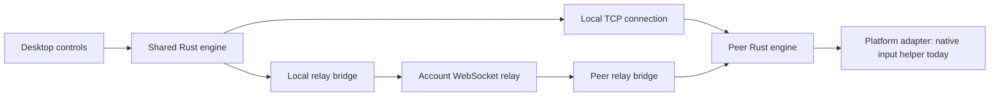

# System overview

[← Index](README.md) · [Code map →](architecture/code-map.md)

extend.computer connects devices to share input and displays across platforms. Devices can send and receive input, share their displays, and present displays from other devices.

- **Apps** manage device setup and connections.
- **Shared engine** manages identity, trust, authorization, and connections.
- **Platform adapters** provide each operating system's input and display capabilities.
- **Account service**, hosted or self-hosted, manages sign-in, device membership, presence, and encrypted relay transport.

## Sharing modes

| Mode | Purpose | Implementation status |
| --- | --- | --- |
| Share input | Use one device's keyboard and mouse to control another | macOS |
| Extend display | Use another device as an additional display | Not supported yet |
| Mirror screen | Present a copy of a device's screen on another | Not supported yet |
| Remote desktop | View and control another device through a remote connection | Not supported yet |

## Components

### Shared engine and clients

| Component | Responsibility | Source |
| --- | --- | --- |
| Desktop UI | Devices, permissions, account sign-in, connection controls, and updates | [`desktop/src/`](../desktop/src/) |
| Desktop runtime | Incoming/outgoing jobs, approvals, presence, and connection lifecycle | [`desktop/src-tauri/src/runtime.rs`](../desktop/src-tauri/src/runtime.rs) |
| Shared engine | Identity, trust, encrypted sessions, input ordering, and reconnect | [`engine/src/lib.rs`](../engine/src/lib.rs) |
| CLI | Terminal commands using the shared engine | [`engine/src/main.rs`](../engine/src/main.rs) |
| Account services | Sign-in, verified device membership, presence, and encrypted relay transport | [`web/`](../web/) and [`server/`](../server/) |

### macOS adapter

| Component | Responsibility | Source |
| --- | --- | --- |
| Native input helper | Screen-edge handoff, input capture, event injection, and emergency stop | [`native/macos/`](../native/macos/) |
| Permission bridge | Permission guidance and background-service setup | [`native/macos/Permissions/`](../native/macos/Permissions/) |
| Wi-Fi broker | Session-scoped AWDL optimization and restoration | [`native/macos/LowJitter/`](../native/macos/LowJitter/) |
| Updater | Sparkle integration and signed release feeds | [`native/macos/Updater/`](../native/macos/Updater/) |

## Device identity

Each device has a cryptographic key pair. Its public key identifies it to other devices; its private key stays on the device, protected by the platform's secure storage.

## Pairing and accounts

Devices can recognize each other in two ways:

- **Pairing:** users verify the two devices and save each other's identities. The pairing remains until removed, independently of accounts.
- **Account membership:** signing in registers the device's existing identity with the account service. Devices in the same account appear automatically. Access lasts while membership remains valid; signing out or removing a device ends account access.

Discovery lists nearby devices by name and network address. The app checks their cryptographic identities before allowing access.

Pairing or account membership lets devices authenticate each other. The receiving device also needs incoming connections enabled and the permissions required by the selected mode. Account-only input control requires local approval of the first request.

## Connection lifecycle

With pairing or account membership established, each connection to another device follows these steps:

1. The initiating device tries the saved local address. Account-connected devices can fall back to an internet relay if the local connection fails.
2. The engine performs a Noise handshake, checks the other device's identity against its pairing or account record, and establishes encryption. Relay servers forward encrypted data without decrypting it.
3. The receiving device checks the selected mode's capabilities, consent, and OS permissions before allowing it to start.
4. Platform adapters prepare the resources needed for the selected mode.
5. The devices exchange the mode's data. For example, input sharing forwards ordered events while preserving key and button transitions.
6. Heartbeats check responsiveness. Disconnect, emergency stop, loss of permission, or an unrecovered failure ends the connection and releases its resources.

## Connection paths

The same pinned encrypted protocol crosses either route. A loopback relay bridge is an implementation detail; it does not make the connection a local-network connection. Account presence can also use relay, so an online device is not proof that direct LAN access works.

## Runtime constraints

- Platform-specific optimizations belong in adapters. The macOS implementation uses a privileged Wi-Fi broker with a narrow authenticated API, and native user-session helpers for input capture and injection.
- The desktop runtime permits one active connection job at a time. The CLI uses the same engine with its own operation and consent flow.

---

[← Index](README.md) · [Code map →](architecture/code-map.md)
